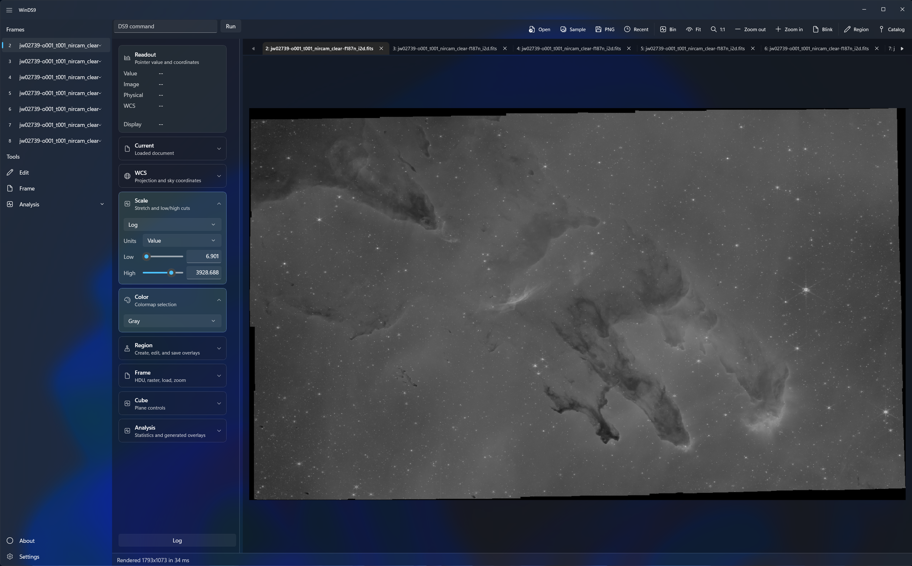

# WinDS9

WinDS9 is an experimental Windows FITS quicklook viewer built with WinUI.

The goal is to make opening local FITS and event files feel more natural on Windows: double-click an app, open a file, inspect the image, check basic pixel/WCS readout, and quickly decide whether the file is worth deeper analysis.

## Current Status

This project is still early. The current version can be useful for quicklook workflows, but it is not a complete replacement for SAOImage DS9.

It can currently help with:

- Opening common FITS image files and Chandra-style event FITS files.
- Showing a rasterized image with sharp pixel zoom.
- Basic scale/color adjustment.
- Basic frame tabs, region/catalog overlays, WCS readout, header view, contours, and simple analysis readouts.
- Quick inspection of local samples without launching the original DS9 process.

Many DS9 features are still incomplete or missing, including full WCS parity, full region editing, advanced catalog tools, full cube workflow, mature analysis tools, GPU rendering, complete command/XPA/SAMP compatibility, and production-quality packaging.

For a complete and professional astronomy workflow, especially if you need reliable DS9 behavior, full WCS support, mature region/catalog handling, or analysis compatibility, installing official SAOImage DS9 inside WSL/Linux is still recommended.

## Download

The easiest build to try is the single-file preview release:

[Download WinDS9 v0.1.0-preview.2](https://github.com/hanberg314/WinDS9/releases/tag/v0.1.0-preview.2)

Download:

`WinDS9-v0.1.0-preview.2-win-x64.exe`

Run the exe directly. On first launch it extracts the app payload to:

`%LOCALAPPDATA%\WinDS9\v0.1.0-preview.2`

This keeps the release download as one file while still letting WinUI load the runtime files it needs internally.

## Development Notes

The technical build notes, project layout, implemented feature list, and test commands were moved to:

[docs/technical-overview.md](docs/technical-overview.md)

## Scope

WinDS9 is currently best understood as a Windows-native FITS quicklook experiment, not a validated scientific replacement for DS9.

Use it when you want a fast local preview. Use official SAOImage DS9 when correctness, compatibility, and full astronomy tooling matter.
